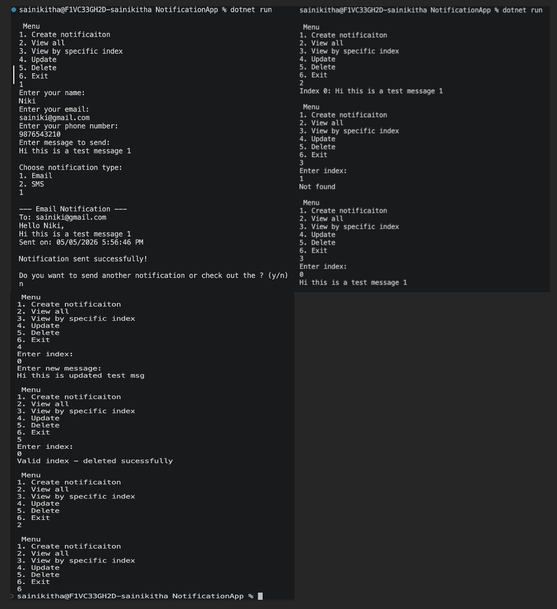

# Notification System (C#)

## Features
- Email Notification
- SMS Notification
- Input Validation
- Loop-based execution
- Create notification (Email / SMS)
- View all notifications
- View by index
- Update notification
- Delete notification
- Loop-based menu interaction

---

## Concepts Used
- OOP (Encapsulation, Abstraction, Polymorphism)
- Interfaces
- Service-based design
- Repository Pattern (basic)
- CRUD operations
- Generic collections (`List<T>`)

---

## Run
dotnet run

---

## Folder-Structure 
```
NotificationApp/
│
├── Models/
│   ├── User.cs
│   └── Notification.cs
│
├── Interfaces/
│   ├── INotification.cs
│   └── IRepository.cs
│
├── Repositories/
│   └── NotificationRepository.cs
│
├── Services/
│   ├── EmailNotification.cs
│   ├── SMSNotification.cs
│   └── NotificationService.cs
│
├── Program.cs
```

---

## Output SS


### CRUD Operations




