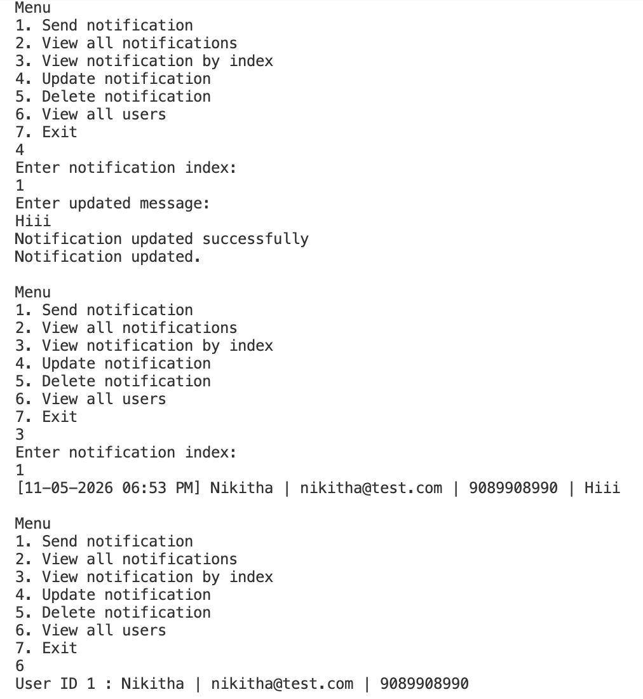

# NotificationApp - 3-Tier Notification System

This C# console application demonstrates a notification management system built using a layered 3-tier architecture with PostgreSQL database connectivity using ADO.NET. The application supports sending notifications through multiple channels, storing notification history in a PostgreSQL database, and performing CRUD operations through a menu-driven console interface.

---

## 📂 Folder Structure

```text
NotificationApp
│
├── BusinessLayer
│   ├── NotificationService.cs
│   └── NotificationExceptions.cs
│
├── DataAccessLayer
│   └── NotificationRepository.cs
│
├── Interfaces
│   ├── INotificationSender.cs
│   └── IRepository.cs
│
├── Models
│   ├── Notification.cs
│   └── User.cs
│
├── NotificationSenders
│   ├── EmailNotificationSender.cs
│   └── SmsNotificationSender.cs
│
└── Program.cs
```

---

## 🛠 Technologies Used

*   **C# .NET** Console Application
*   **PostgreSQL** Database
*   **ADO.NET** (Npgsql Package)

---

## 💡 Concepts Demonstrated

*   **3-Tier Architecture:** Presentation Layer, Business Layer, and Data Access Layer.
*   **PostgreSQL Connectivity:** Using ADO.NET for database operations.
*   **Interfaces & Polymorphism:** Decoupled notification sending logic.
*   **Repository Pattern:** Abstracting data access logic.
*   **Business Logic Validation:** Centralized rules and custom exception handling.
*   **LINQ:** Used for data validation and collection processing.
*   **Separation of Concerns:** Distinct responsibilities for each project layer.

---

## 🗄 Database Schema

### Users Table
```sql
CREATE TABLE IF NOT EXISTS users (
    user_id SERIAL PRIMARY KEY,
    name VARCHAR(100) NOT NULL,
    email VARCHAR(150),
    phone VARCHAR(20)
);
```

### Notifications Table
```sql
CREATE TABLE IF NOT EXISTS notifications (
    notification_id SERIAL PRIMARY KEY,
    message TEXT NOT NULL,
    sent_date TIMESTAMP,
    notification_type VARCHAR(20),
    user_id INT REFERENCES users(user_id)
);
```

---

## 📄 File Responsibilities

*   **Program.cs:** Handles the console menu, user interaction, and navigation flow.
*   **NotificationService.cs:** Implements business rules, validation, and sender selection.
*   **NotificationRepository.cs:** Manages SQL queries and PostgreSQL CRUD operations.
*   **INotificationSender.cs:** Interface for Email and SMS sending logic (Polymorphism).
*   **IRepository.cs:** Defines the contract for data persistence.
*   **Models (User/Notification):** Data structures with built-in formatting and validation helpers.
*   **NotificationExceptions.cs:** Custom exceptions for validation and processing failures.

---

## 🚀 Application Flow

1.  **Selection:** User selects an action from the console menu.
2.  **Input:** User enters notification details and recipient information.
3.  **Validation:** `NotificationService.cs` validates inputs against business rules.
4.  **Processing:** The system selects the appropriate sender (Email/SMS) via polymorphism.
5.  **Persistence:** Data is saved to the PostgreSQL database using the Repository.
6.  **Management:** Users can later View, Update, or Delete notification records.

---

## ✅ Validation Rules

### Email Notifications
*   Email must contain `@` and `.`
*   Message cannot exceed 1000 characters.

### SMS Notifications
*   Phone number must contain exactly 10 digits.
*   Message cannot exceed 160 characters.

### Common Rules
*   User name cannot be empty.
*   Notification message cannot be blank.

---

## 🖥 How to Run

1. Ensure you have a **PostgreSQL** instance running.
2. Update the connection string in `NotificationRepository.cs`.
3. Open your terminal in the project root.
4. Run the following command:
   ```bash
   dotnet run
   ```

---

## ## Output Screenshots

### 1. Send Notification


### 2. View All and by IndexNotifications


### 3. View users and Update


### 4. Delete Notification


### 6. Validation cases
