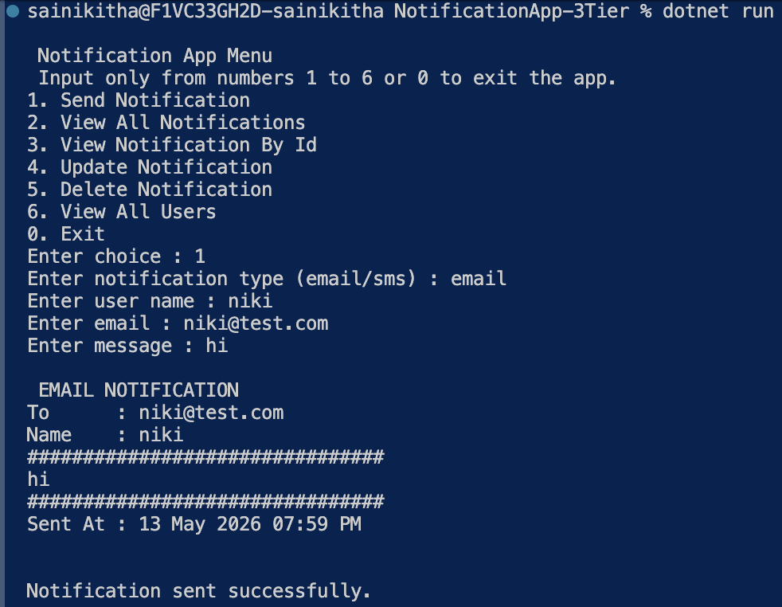
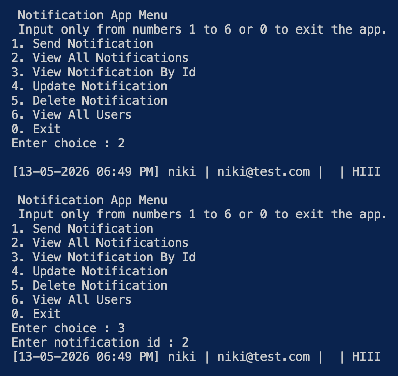
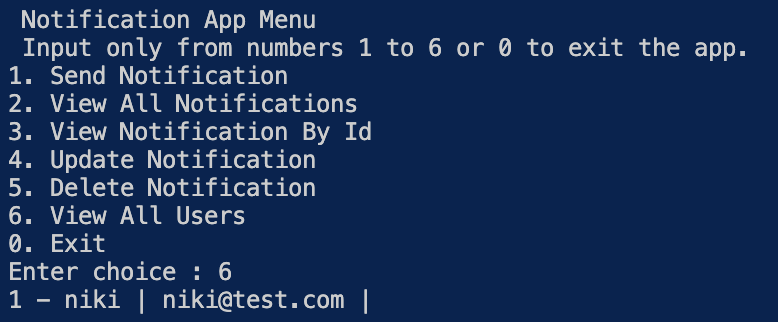
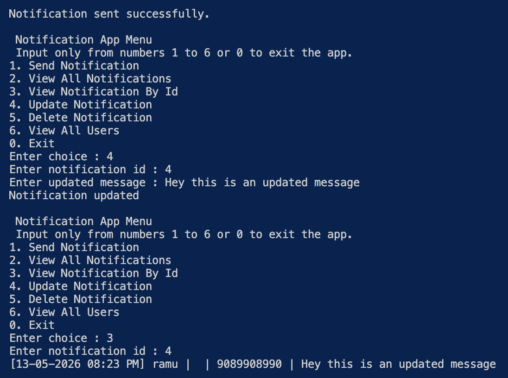
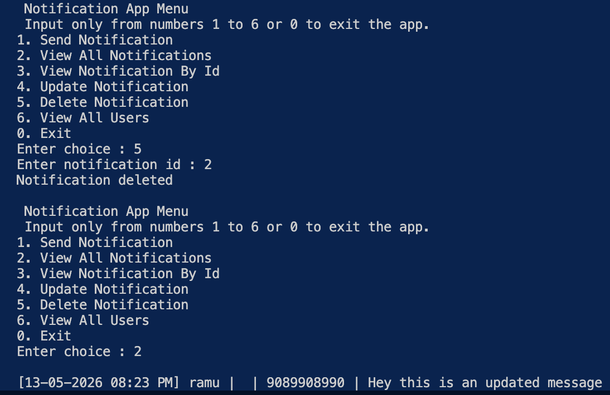
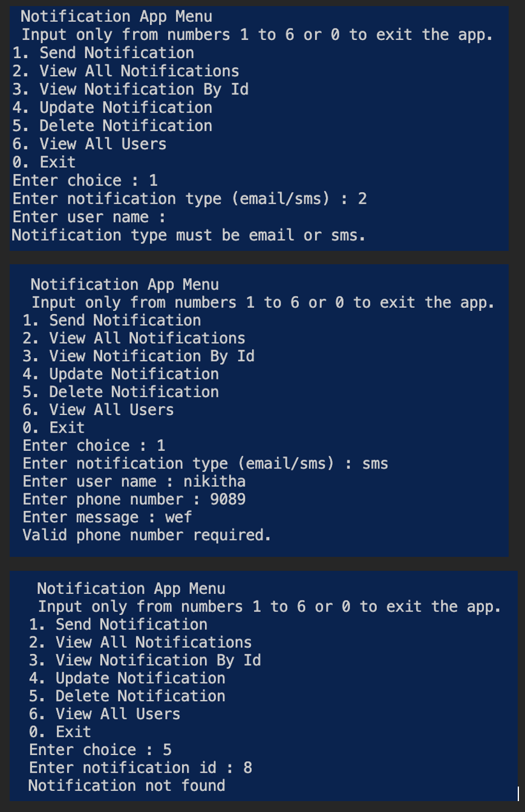
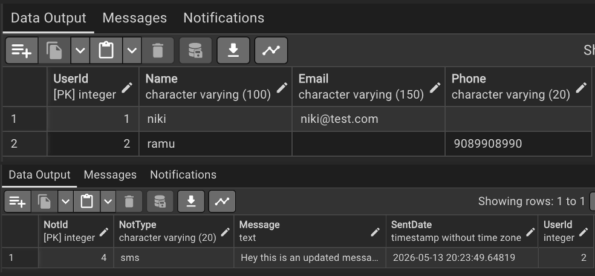

# NotificationApp - EF Core Notification Management System

A C# console application demonstrating a notification management system built with a 3-tier architecture, PostgreSQL integration, Entity Framework Core, and Fluent API configuration. It supports dynamic notification routing (Email/SMS), input validation, history tracking, and full CRUD operations.

---

## Folder Structure

```text
NotificationApp-3Tier/
│
├── NotificationBLLibrary/
│   ├── Exceptions/
│   │   └── NotificationExceptions.cs
│   ├── Interfaces/
│   │   └── INotificationService.cs
│   └── Services/
│       └── NotificationService.cs
│
├── NotificationDALLibrary/
│   ├── Contexts/
│   │   └── NotificationContext.cs
│   ├── Interfaces/
│   │   └── IRepository.cs
│   ├── Repositories/
│   │   ├── AbstractRepository.cs
│   │   ├── NotificationRepository.cs
│   │   └── UserRepository.cs
│   └── Migrations/
│
├── NotificationFEApplication/
│   └── Program.cs
│
├── NotificationModelLibrary/
│   ├── Notification.cs
│   ├── NotificationPartial.cs
│   ├── User.cs
│   └── UserPartial.cs
│
└── NotificationSenderLibrary/
    ├── Interfaces/
    │   └── INotificationSender.cs
    ├── EmailNotificationSender.cs
    └── SmsNotificationSender.cs
```

---

## Technologies Used

*   **Language:** C# (.NET Console Application)
*   **Database:** PostgreSQL
*   **ORM:** Entity Framework Core
*   **Database Provider:** Npgsql.EntityFrameworkCore.PostgreSQL
*   **Design Tools:** Fluent API Configuration, EF Core Migrations

---

## Concepts Demonstrated

*   **3-Tier Architecture:** Complete separation of Presentation (FE), Business Logic (BLL), and Data Access (DAL) layers.
*   **Repository Pattern:** Generic `AbstractRepository` subclassed by specialized `NotificationRepository` and `UserRepository`.
*   **Fluent API Mapping:** Explicit entity constraints, property types, and relationship behaviors bypassing data annotations.
*   **Runtime Polymorphism:** Dynamic selection of `INotificationSender` implementations (Email/SMS) at runtime.
*   **Partial Classes:** Separation of auto-generated database entity schemas from domain business logic extension methods.

---

## Database Schema & Relationships

### Users Table

| Column Name | Data Type | Constraints |
| :--- | :--- | :--- |
| `UserId` | Integer | Primary Key, Identity |
| `Name` | Varchar | Required |
| `Email` | Varchar | Required |
| `Phone` | Varchar | Required |

### Notifications Table

| Column Name | Data Type | Constraints |
| :--- | :--- | :--- |
| `NotId` | Integer | Primary Key, Identity |
| `Message` | Text | Required |
| `SentDate` | Timestamp | Required |
| `NotType` | Varchar | Required |
| `UserId` | Integer | Foreign Key, Cascade Delete |

### Relationship Mapping
One **User** can have many **Notifications** (1:M). Configured via Fluent API:
```csharp
modelBuilder.Entity<Notification>()
    .HasOne(n => n.Sender)
    .WithMany(u => u.Notifications)
    .HasForeignKey(n => n.UserId)
    .OnDelete(DeleteBehavior.Cascade);
```

---

## File Responsibilities

*   **`NotificationContext.cs`:** Manages database connectivity, underlying `DbSet` tracking, and database schema creation logic.
*   **`NotificationRepository.cs` / `UserRepository.cs`:** Executes targeted LINQ expressions for advanced search filters and entity persistence.
*   **`NotificationService.cs`:** Evaluates infrastructure rules, processes transactions, and invokes targeted send engines.
*   **`NotificationSenderLibrary`:** Standardizes payloads and simulates external dispatch protocols for distinct channels.
*   **`Program.cs`:** Drives user navigation menus, aggregates keystroke strings, and captures runtime errors.

---

## Application Flow

1. **Input Selection:** User chooses target system notification channel from a console menu layout.
2. **Identity Evaluation:** System searches for an existing User match or spins up a new identity entry.
3. **Data Verification:** The BLL assesses parameters against critical messaging rules.
4. **Dynamic Despatch:** Interface instances shift implementations to execute matching channel behaviors.
5. **Database Sync:** The execution footprint commits structural state logs back to PostgreSQL via EF Core tracking.

---

## Validation Rules

### Common Rules
*   User name value cannot be null or whitespace string characters.
*   Notification text message payload cannot be completely blank.
*   Notification channel select mode must explicitly evaluate to `email` or `sms`.

### Email Notifications
*   Target addresses must contain an explicit `@` character symbol.
*   Target addresses must resolve with a valid `.` domain separator symbol.
*   Body text string length cannot exceed `1000` total characters.

### SMS Notifications
*   Target contact strings must evaluate to exactly `10` digit numbers.
*   Body text string length cannot exceed `160` total characters.

---

## EF Core Features Used

*   **Code First Approach:** Source schema files define the final layout generation.
*   **Navigation Properties:** Native tracking relationships allow seamless multi-table relational entry point operations.
*   **Change Tracking:** Automated state evaluation flags entities safely for processing during transactions.
*   **LINQ Queries:** Type-safe SQL generation abstracts structural database interactions.

---

## How to Run

1. Ensure a **PostgreSQL** database server instance is active.
2. Update connection context credentials found within your project text file:
   `NotificationDALLibrary/Contexts/NotificationContext.cs`
3. Launch a terminal window operating inside the root container directory paths:
   ```bash
   dotnet ef migrations add InitialCreate --project NotificationDALLibrary --startup-project NotificationFEApplication
   dotnet ef database update --project NotificationDALLibrary --startup-project NotificationFEApplication
   ```
4. Execute application code loops directly via your terminal tools:
   ```bash
   dotnet run --project NotificationFEApplication
   ```
---


## ## Output Screenshots

### 1. Send Notification


### 2. View All and by IndexNotifications


### 3. View users


### 4. Update


### 4. Delete Notification


### 5. Validation cases


### 6. PostgreSQL Database Tables 
