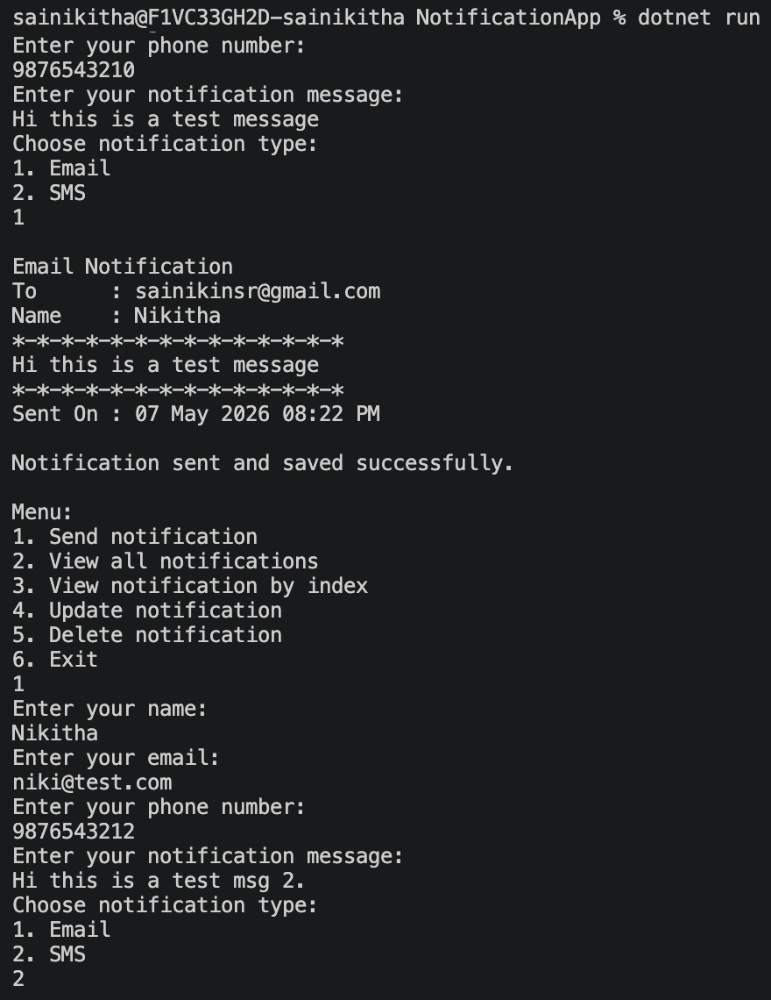
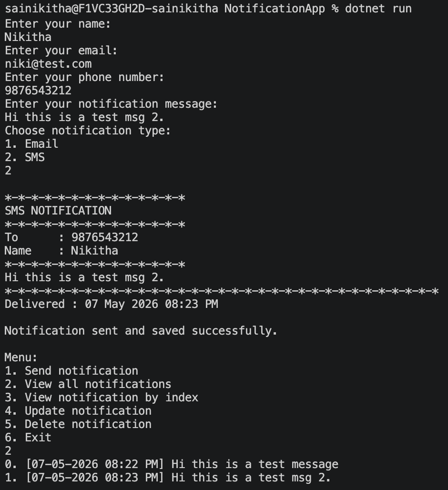
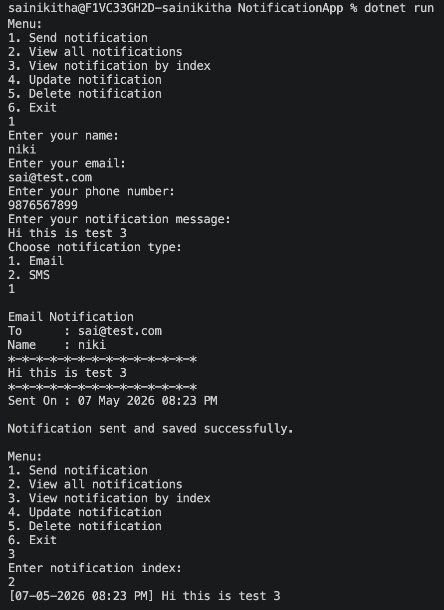

# NotificationApp - 3-Tier Notification System

This C# console application demonstrates a simple notification system built using a 3-tier architecture.

## Folder Structure

```
NotificationApp
│
├── BusinessLayer
│   ├── NotificationService.cs
|   └── NotificationExceptions.cs
├── DataAccessLayer
│   └── NotificationRepository.cs
├── Interfaces
│   ├── INotificationSender.cs
│   └── IRepository.cs
├── Models
│   ├── Notification.cs
│   └── User.cs
├── NotificationSenders
│   ├── EmailNotificationSender.cs
│   └── SmsNotificationSender.cs
└── Program.cs
```

## Concepts Demonstrated

- 3-Tier Architecture: Presentation, Business, Data Access
- Interfaces and polymorphism
- Encapsulation through model classes
- Business logic validation in the service layer
- Interaction between layers
- Collection usage with `List<T>`
- LINQ (`All()` method for phone validation)
- CRUD Operations
- Custom Exception Handling
- Separation of Concerns

## File Responsibilities

- `Program.cs`: User interaction, menu flow, and presentation logic.
- `BusinessLayer/NotificationService.cs`: Validates user and message input, applies notification rules, chooses the correct sender, and saves notification details.
- `DataAccessLayer/NotificationRepository.cs`: Stores sent notifications in memory and returns sent notification records.
- `Interfaces/INotificationSender.cs`: Defines the contract for all notification sender implementations.
- `Interfaces/IRepository.cs`: Defines the data access contract for notification storage.
- `Models/User.cs`: Represents customer details and validation helpers.
- `Models/Notification.cs`: Represents a sent notification and audit formatting.
- `NotificationSenders/EmailNotificationSender.cs`: Sends notifications through the email channel.
- `NotificationSenders/SmsNotificationSender.cs`: Sends notifications through the SMS channel.
- `BusinessLayer/NotificationExceptions.cs`: Contains custom exceptions used for validation and notification processing failures.

## Run

```bash
dotnet run
```

## Application Flow

1. User enters details through the console menu.
2. `Program.cs` sends data to the Business Layer.
3. `NotificationService` validates user and notification data.
4. Business rules are applied based on notification type.
5. Appropriate sender object is selected using polymorphism.
6. Notification is sent using Email or SMS sender.
7. Notification details are stored using the repository layer.
8. Stored notifications can later be viewed, updated, or deleted.

## Exception Handling

Custom exceptions are used to separate:

- Validation failures (`NotificationValidationException`)
- Processing/system failures (`NotificationProcessException`)

This improves error handling clarity and keeps business validation centralized inside the Business Layer.

## LINQ Usage

The project uses LINQ methods for validation logic.

Example:
- `All()` method used to verify that all phone number characters are digits.

## Features

- Send notifications using Email or SMS
- CRUD operations for notifications
- Notification history storage
- Business rule validation
- Console-based menu system
- Layered architecture implementation
- Custom exception handling

## Output Screenshots

### Email Notification



---

### SMS Notification



---

### View Notifications



---

### Delete Notification

